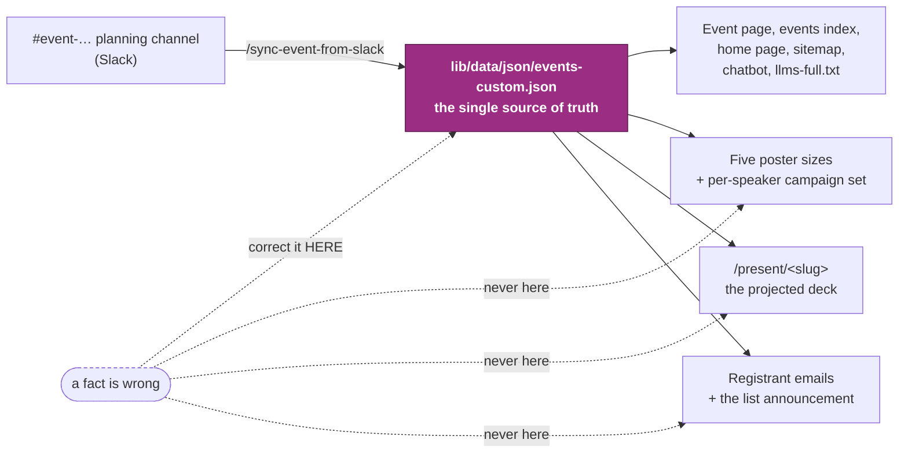
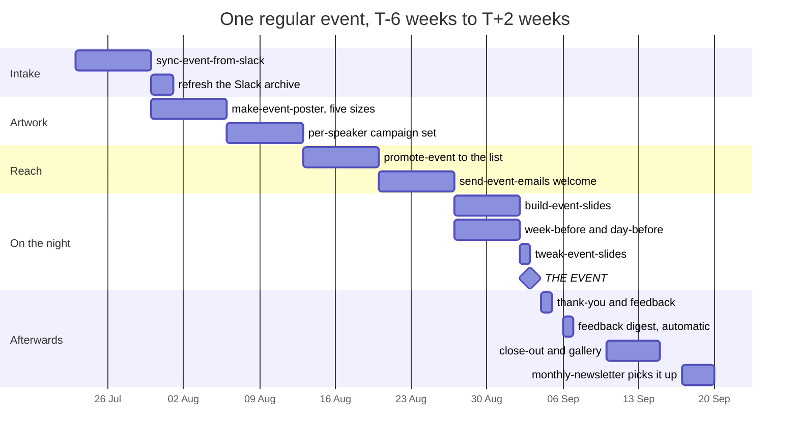
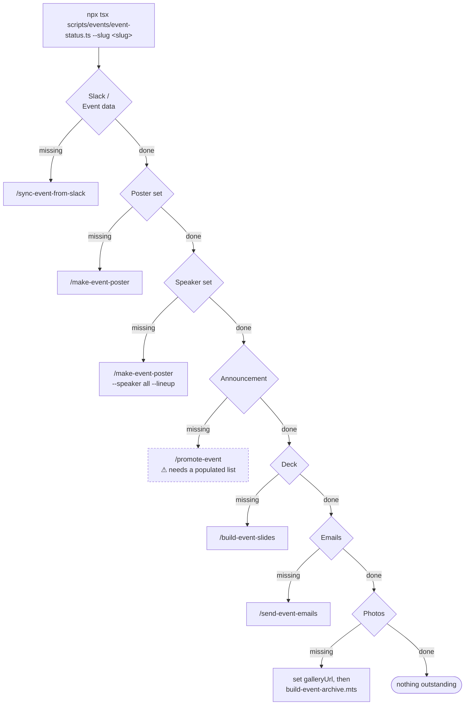
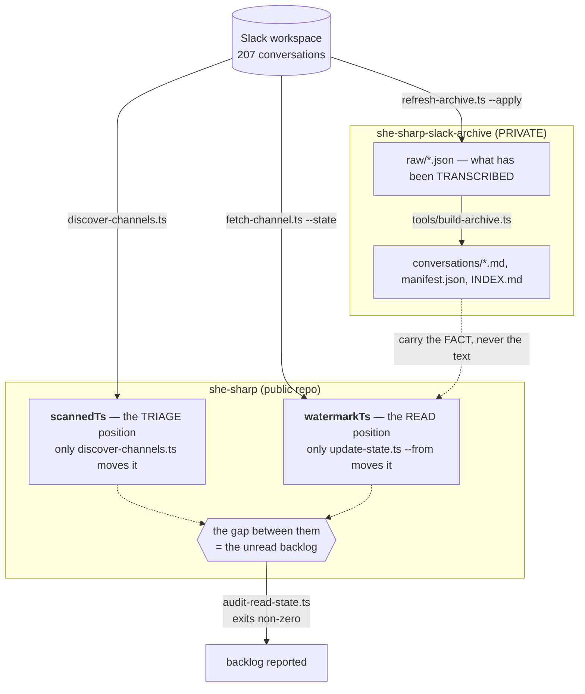

# Event lifecycle — the standard procedure

> How one regular She Sharp event travels from a Slack channel to a page, a
> poster, a projector, an inbox and an archive. Written 2026-08-21, against what
> is actually in the repo rather than against an intended design.

She Sharp runs a regular evening event roughly monthly — a panel, a talk, a
workshop — plus the occasional flagship. Every regular event needs the same work
in the same order, and nearly all of it is automated. What was missing until now
was **the order itself**: eleven skills each did one part and none knew what came
before or after it.

This document is that order. `/run-event-playbook` is the same thing as a skill
you can run, and `scripts/events/event-status.ts` is the same thing as a command
that answers "where has this event got to?" in one line per stage.

**Read the skill, not this file, to do a step.** Each `.claude/skills/*/SKILL.md`
is dense, specific, and carries the reasoning behind rules this page only names.
This page is the map; they are the territory.

---

## 1. The one rule everything else follows



The event record is the source; everything else is a view of it. The deck reads
it live through `lib/deck/event-source.ts`, the poster reads it at build time,
and the emails read it through `scripts/events/resolve-event.ts`. So **a
correction goes into the JSON and every artefact follows** — and a fact typed
into a deck or a poster to save a step is a fact that will one day contradict
the event page nobody thought to re-check.

Corrections touch `detailPageData` only. Never `id`, never `slug`: the slug is
the public URL, the deck route **and** the feedback QR code all at once.

---

## 2. The timeline



Dated against the real Les Mills evening, 3 September 2026. The distances are
typical, not binding — a workshop booked three weeks out compresses the front
half, and nothing in the pipeline requires six weeks.

---

## 3. Start here, every time

```bash
npx tsx scripts/events/event-status.ts --slug <event-slug>
```

Offline, read-only, needs no network and no database. It reads seven separate
state sources and prints one checklist, naming the command or skill that closes
every gap:

```
event-lesmills-03-september-2026 — No Pain, All Gain – Getting Fit for AI
  Thursday, 3 September 2026 · 5:00pm – 7:30pm NZST · Les Mills Auckland City · in 13 days

  Slack        done     #event-lesmills-03-september-2026, read to 12 Aug 2026, no backlog
  Event data   done     4 speakers · 1 sponsor · 2 sections · registration link set
  Cover image  done     /img/events/event-lesmills-03-september-2026/cover.webp
  Poster set   done     poster, social, humanitix, story, square
  Speaker set  done     4 of 4 speakers + line-up tile
  Deck         done     /present/event-lesmills-03-september-2026 · 25 slides
  Feedback     done     www.shesharp.org.nz/f/l03s26
  Announcement missing  no announcement broadcast has ever been recorded
                        → /email-the-community  (needs a consented Resend segment first)
  Emails       missing  welcome, week-before, day-before, thank-you unsent
                        → /send-event-emails
  Photos       n/a      the event has not happened yet

1 event · 2 checks missing
```

`--upcoming` (the default), `--all`, `--past [N]`, `--slug` (repeatable),
`--json`. It exits 0 on a report — it is not a gate — and 1 only on a real error.
`scripts/events/event-status.test.ts` runs it in CI against the live repo data,
so a source moving underneath it fails a pull request rather than going quiet.



---

## 4. The phases

Each row is **a gate, then a skill**. The gate is what must be true before the
skill can do its job; running a step whose gate is unmet is how a wrong date
reaches a projector or a poster.

| When | Gate — true before you start | Run | Produces |
|---|---|---|---|
| T-6w | a Slack planning channel exists | `/sync-event-from-slack` | the event in `events-custom.json`, assets in `public/img/events/<slug>/` |
| T-6w | the fetch payload was recorded | its **Step 7.6** archive refresh | the verbatim archive level with Slack |
| T-5w | date, venue, title confirmed **in the event record** | `/make-event-poster` | `poster`, `social`, `story`, `square`, `humanitix` |
| T-4w | every speaker has a headshot in the event record | `/make-event-poster --speaker all --lineup` | one poster per person + the line-up tile |
| T-3w | the Resend segment has contacts | `/promote-event` → `/email-the-community` | one scheduled broadcast |
| T-2w | a Humanitix export **with an attendee email column**, in `tmp/` | `/send-event-emails welcome` | a ledger entry |
| T-1w | a run sheet in the event data | `/build-event-slides` | `/present/<slug>`, `index-meta.ts` |
| T-7d | agenda, parking and transport known | `/send-event-emails week-before` | a ledger entry |
| T-1d | room/level or the join link known | `/send-event-emails day-before` | a ledger entry |
| T-1h | the deck already exists | `/tweak-event-slides` | pushed to `main`, live in ~3 min |
| **T+0** | — | project the deck; the `/f/<code>` QR is on the feedback slide | — |
| T+1d | a feedback form URL | `/send-event-emails thank-you` | a ledger entry |
| T+3d | — | **nothing — the cron does it** | the feedback digest in Slack |
| T+1w | the photo album URL is known | set `galleryUrl`, `build-event-archive.mts --slug <slug>`, `apply-humanitix-attendance.ts` | a past-event page with photos and figures |
| T+2w | — | `/monthly-newsletter` | the event in the month's issue |

**Four emails about a two-hour evening is too many.** For a single-session
event, `welcome` + `day-before` is usually the whole programme. A stage nobody
asked for is not sent.

---

## 5. The two read positions, and why they are two



`watermarkTs` means *the model was handed this content*. `scannedTs` means *the
triage glanced at it and scored it quiet*. They were one field for months, which
is why four separate misses happened — including the events lead asking by DM
for a page change, hidden behind a signal heuristic that scored the request at
zero because it named no venue, date or ticket.

The archive is a **third**, separate position. Every sync moves the repo's
positions and not the archive's, so it drifts every time. Until Step 7.6 existed
nothing in any step list moved it at all — and all three gates in the sync
skill's Step 7.5 stayed green throughout, because none of them looks at it.

**As of 2026-08-21 the archive is 15 conversations behind**, four of them event
channels. `refresh-archive.ts --archive <path>` (dry run by default) reports it.

**Nothing from the archive may be copied into this repo.** It holds verbatim
DMs, attendee spreadsheets, a storeroom door code and a `SHE#…` ticket-code
series some of which is still live. Carry the fact, never the text.

---

## 6. Who writes what

Nothing in this pipeline shares a state file, deliberately — each ledger is
owned by exactly one writer, so "who did this and when?" always has an answer.

| File | Written by | Records |
|---|---|---|
| `lib/data/json/events-custom.json` | `/sync-event-from-slack`, `scripts/data/*` | the event itself — **the source of truth** |
| `.claude/skills/sync-event-from-slack/state/sync-state.json` | `update-state.ts` (read), `discover-channels.ts` (scan) | per-conversation read + triage positions, event mapping, the carried digest |
| `lib/deck/registry.ts`, `lib/deck/index-meta.ts` | `scripts/deck/sync-registry.ts` — **generated, never hand-edited** | which decks exist and what the site may say about them |
| `public/img/events/<slug>/index.ts` | `build-event-poster.ts --speaker` | the campaign set, so unreferenced files are accounted for |
| `.claude/skills/send-event-emails/state/event-emails.json` | `event-ledger.ts` | which stage reached whom, as sha256 hashes — what makes a failed send resume rather than restart |
| `.claude/skills/email-the-community/state/broadcasts.json` | `broadcast-ledger.ts` | broadcast id and status, so one announcement cannot go twice |
| `.claude/skills/update-mailing-list/state/roster.json` | `diff-roster.ts` | import history — **Resend itself is the consent record, not this file** |
| `lib/data/event-archive-photos.ts` | `scripts/build-event-archive.mts` | harvested gallery photos per slug |

---

## 7. What fails the build

CI (`.github/workflows/verify.yml`) runs on pull requests to `main` only.
**Pushing straight to `main` bypasses every one of these** — which is the entire
reason `/tweak-event-slides` runs its three checks locally before it pushes.

- `scripts/verify-image-paths.ts` — every referenced image resolves, every file
  is referenced, every event image sits in its own event's folder
- `scripts/events/event-status.test.ts` — the lifecycle report still reads all
  seven of its sources
- `.claude/skills/sync-event-from-slack/scripts/state-lib.test.ts` and
  `audit-read-state.ts` — the read-position rules, and no unread backlog
- `lib/deck/deck.test.ts` — every deck registered, copy and rhythm limits, and
  **every feedback code unique and resolving back to its own event**
- `pnpm typecheck`, `pnpm typecheck:scripts`, `pnpm lint` (errors only)

Not in CI, run locally: `npx tsx lib/email/hardening.test.ts` before touching
anything that sends.

Merging to `main` triggers `.github/workflows/deploy.yml`. **There are no
preview deploys** — whatever was verified locally is the only verification there
is.

---

## 8. Things that are true and look like bugs

Each of these was checked against the code on 2026-08-21. Every one of them has
sent somebody looking for a fault that was not there.

**`detailPageData.status` is never read by the website.** `getUpcomingEvents()`
and `getPastEvents()` filter on the **date** alone, and no component renders
`status`. An event becomes "past" by itself at midnight. Flipping the field to
`completed` clears the sync triage's `stale-status` row and nothing else — the
page is not waiting on it.

**`isFeatured` is currently inert.** `getFeaturedEvent()` searches only
*upcoming* events for the flag, and the only record carrying `isFeatured: true`
is in the past. So the homepage is simply showing the nearest upcoming event.
Setting the flag on a future event is how you override that.

**`event_registrations` is empty and stays empty.** Humanitix is the system of
record for who is coming; the list arrives as a CSV a human exports. Nothing
about attendance is discoverable from this codebase.

**Registering is not subscribing.** Someone who bought a ticket agreed to hear
about *that event*. Promoting anything else to them is a consent violation, and
`lib/email/audience.ts` refuses it rather than leaving it to judgement. The only
ways the mailing list grows are in
`.claude/skills/update-mailing-list/references/consent-rules.md`.

**A deck slug IS its event slug**, and the feedback code is derived from it. A
deck built against the wrong event collects the wrong feedback and looks
perfectly correct from the front of the room, which is why
`feedback-qr-event-mismatch` is an error and must never be silenced.

**`--skip-existing` on a stale refetch list refetches nothing.** It skips any
destination already parsing as `_meta.mode: "full"` — which every stale payload
is. It prints `skip … (already full)` down the whole list and exits 0.
`refresh-archive.ts` runs stale and new as separate passes for this reason.

---

## 9. Known limitations

Honest, current, and each one is somebody's decision to make rather than a bug
to fix quietly.

1. **The promotion path cannot complete today.** The Resend roster records no
   imports and no broadcast has ever been sent; the live newsletter still goes
   out through **Mailchimp**. `/promote-event` is built and gated behind
   `/update-mailing-list` having actually populated the list. It says so up
   front rather than failing obscurely.
2. **The announcement cover is heavier than it should be.** Every event's
   `coverImage.url` is WebP, which Outlook renders as a broken-image box, so the
   generator looks for a JPEG in the event's folder instead. For the Les Mills
   event that is the 3200×1600 Humanitix banner — 402 KB filling a ~600 px slot.
   The `size-100kb` gate measures HTML, not images, so it passes. The real fix
   is an email-sized banner out of the poster pipeline, not a different pick.
3. **`event-ledger.ts` and `broadcast-ledger.ts` cannot be imported** — both call
   `main()` unguarded — so the lifecycle report reads their JSON directly and
   types it from the writers. If either shape changes, `event-status.test.ts` is
   what notices.
4. **Past events are checked only against their description.** Holding the full
   set to every check put 47 `missing` lines on scraped pre-2020 history, each
   naming a Slack channel that never existed.
5. **The flagship shape is different and is not covered here.** The 2026 AI
   Hackathon Festival ran 91 slides against a regular evening's 25, over two
   days, with judges and mentors rather than a panel, and its own bespoke deck
   skin. Use the individual skills.
6. **`check-hackathon-facts.ts` cannot verify its counterpart.** It prints a
   sha256 that `event-qa-ai-template` must match, and nothing checks that across
   the two repositories.

---

## 10. On the night

One page for whoever is clicking.

- Open `/present/<slug>` **ten minutes early**, wait for the loading chip to
  disappear, then **do not reload**.
- `L` stops all motion. The deck still looks right standing still; use it on an
  old venue laptop that stutters.
- Take the **PDF backup** — `<url>?print=1`, print to PDF. It survives dead
  venue wifi and a laptop that will not talk to the projector.
- Paste the feedback link in plain text into the venue chat and the thank-you
  email: `shesharp.org.nz/f/<code>`. Everyone who was looking at their phone
  when the QR was on screen, or who left early, can still answer.
- A last-minute copy change is `/tweak-event-slides`, not a hand edit — live in
  about three minutes.
- `MAINTENANCE_MODE=true` takes the **feedback form** down too, `/f/*` included.

---

## See also

- `.claude/skills/run-event-playbook/SKILL.md` — this document as a skill
- `docs/development/AI_SKILLS_GUIDE.md` — the non-technical walkthrough
- `docs/development/DECK_SYSTEM.md`, `EVENT_FEEDBACK.md`, `EMAIL_OPERATIONS.md`,
  `ADD_EVENTS.md`, `CONTENT_RULES.md`
- `public/img/events/README.md` — one folder per event, and why
- `lib/data/json/README.md` — which event file owns what
