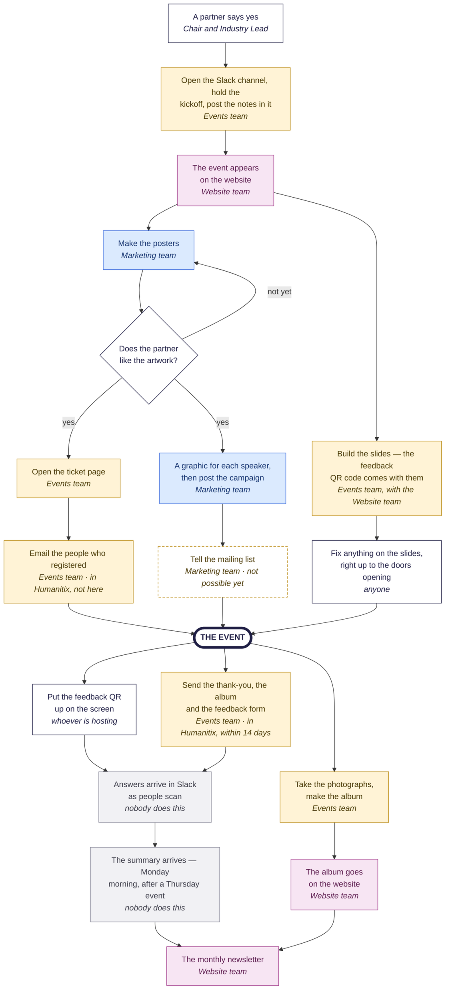

# The event playbook

Everything She Sharp does to run one evening event, on one page.

**How to use this.** Look at the picture. Find your team's colour. Scroll to your
team, copy the grey box, change the words in CAPITALS, and paste it into the chat
panel in Cursor. That is the whole method.

You do not need to understand how any of it works. Nothing is sent, published or
changed until it shows you what it is about to do and you say yes.

---

## The whole thing, once



| Colour | Who |
|---|---|
| Gold | **Events team** — Nikita, Nirmala, Moksha, Tharaneetharan |
| Blue | **Marketing team** — Marriane, Sara, Len, Gurleen |
| Pink | **Website team** — Chan Meng. You ask; you do not do these yourself |
| Grey | **Nobody.** It happens on its own |
| White | Nobody's exclusive job — a partner, the Chair, whoever is hosting, or anyone who spots a typo |
| Dashed gold | Built, but **not possible yet** |

---

## Events team

Yours: the channel, the kickoff notes, chasing the details out of the partner,
the ticket page, the room on the night, the photographs, and the emails to
the people who registered.

### Find out what is still outstanding

```
Where are we up to on the EVENT NAME event? List what is still outstanding in
plain English, and tell me which of them are mine.
```

### Get something changed on the website

You do not do this one yourself. Post this in **#website-team** and it will be
done, usually within a day:

```
Please update the EVENT NAME event page.
What to change: WHAT IS WRONG NOW, AND WHAT IT SHOULD SAY.
Attached: THE PHOTO / THE RUN SHEET LINK / NOTHING.
Needed by: THE DAY, AND WHY.
```

**Do not send it as a direct message.** Messages in that channel are always read;
a DM is easily missed.

### Email the people who registered

**This one is not here.** You do it in **Humanitix**: open the event, go to
**Email campaigns**, and write it there. Humanitix already knows who bought a
ticket, so there is nothing to export and nothing to save into the project.
Nobody needs to type anything into a chat panel for this.

**Two emails about a two-hour evening is usually plenty** — a welcome when they
register, and one the day before with the room number.

Two things about that tool nobody can change from this side:

- **It comes from Humanitix's address, not `shesharp.org.nz`.** You can change
  the *name* it appears to come from, not the address.
- **After 14 days it stops.** Humanitix will not email an event that finished
  more than two weeks ago. So send the thank-you **the day after**, not when the
  photos are ready — a fortnight later there is no way to reach those people.

### The day after

Send the thank-you from **Humanitix → Email campaigns**, the same way, with the
album link and the feedback form in it. Do it the next day, because of the
14-day limit above.

Then post the album link in **#website-team** so it goes onto the event page:

```
Photos from EVENT NAME are up: ALBUM LINK — please add them to the event page.
```

### What arrives on its own

Once the QR code has been on the screen, you do not have to do anything to
collect feedback. Every answer appears in **#event-feedback-notifications** as it
is submitted, and a summary follows three days later — which for a Thursday
evening is **Monday morning**.

---

## Marketing team

Yours: every piece of artwork, and the campaign.

### Make the posters

```
Make the posters for the EVENT NAME event.
Show me a few picture options first and let me choose.
When they are done, put them on a new branch and open a pull request — do not
push to main — and give me the link.
```

You get six sizes from one picture: the ticketing banner, the LinkedIn and
Instagram posts, the story, the square tile, and the print poster.

### Ask for a different version

Asking again is cheap and expected. There is no limit and nobody to ask.

```
Try that again with A DARKER PICTURE — and keep the previous version too.
```

Replace the capitals with whatever you actually want: *more space for the
title*, *something less literal*, *the partner's brand colours*.

### One graphic per speaker

```
Make a graphic for each speaker at the EVENT NAME event, plus the line-up tile.
Each one needs a one-line hook — draft them from the speakers' own bios and show
me before you build anything.
Then put them on a new branch and open a pull request.
```

Post one speaker a week rather than everything at once. The link, the date and
the venue stay the same; only the face changes, so the campaign builds instead of
repeating.

### Telling the mailing list

**Possible since 2026-08-31**, when the first newsletter went out from the new
system to all 1,549 subscribers. It is not a self-service button: a send needs an
approval chain that ends with the founder, and there is a hard cap of **three
marketing emails per calendar month** across every skill combined. Ask in
`#website-team` before assuming a send can happen this week.

The rules about who may be emailed, which system sends what, and how often, are
on their own page: **the email playbook**, at `/internal/email-playbook`.

---

## Whoever is hosting on the night

### Fix something on the slides

Right up to the doors opening:

```
On the EVENT NAME slides, change WHAT IS WRONG to WHAT IT SHOULD SAY.
This goes live straight away, so show me exactly what you are changing first.
```

It is on the screen about three minutes later. **This one has no undo**, which is
why it is only ever for one small thing — a word, a name, a photograph.

### On the night itself

- Open the slides **ten minutes early** and then do not reload the page.
- Print a **PDF backup** before you leave home. Venue wifi fails.
- Put the feedback QR up, and also paste the short link into the venue chat —
  people who were looking at their phone can still answer.

---

## Website team

Everything pink in the picture is Chan Meng: putting the event on the website,
adding the album, and the monthly newsletter. You never need to do these — you
ask in **#website-team**, using the template in the Events section above.

There is one reason it works this way rather than anyone doing it: putting an
event on the website also moves a private archive of the Slack conversation
behind it, and the two have to stay in step.

---

## Four rules that matter

1. **If you did not see a summary, stop.** Everything shows you what it is about
   to do. If something happened without asking, say so in `#website-team`.
2. **Never put a code in an email, a poster or the website** — registration
   codes, discount codes, door codes, meeting passwords. Link to the public page
   instead. This has gone wrong before and it was expensive to undo.
3. **Never add someone to the mailing list because they came to an event.**
   Buying a ticket is not subscribing. If you try, it will refuse — and that
   refusal is correct.
4. **Never publish a photograph where a child is the subject**, and never name a
   child anywhere. A child inside a wide group shot is fine; a photograph *of*
   them is not.

---

## First time? About half an hour

You need [Cursor](https://cursor.com) — free, download it and open it. Then paste
this into its chat panel:

```
I am setting up this project for the first time and I have never used a
terminal. I am on WINDOWS OR A MAC.
Check whether git, node, gh and resend are installed, and install anything
missing — node must be version 22.
Then sign me in to GitHub, clone NZ-SheSharp/she-sharp, open that folder, and
install the project's dependencies with: npx pnpm@10 install
Tell me before you run anything, do it one step at a time, and stop if something
needs an administrator so I can ask.
```

Then ask an admin for **three things** — they are the only parts you cannot do
yourself:

- **to be added to the NZ-SheSharp organisation on GitHub**, using the email
  address your GitHub account uses. Without this the step above cannot find the
  project at all
- the `.env` file, saved into the project folder
- a **full-access** Resend key, for anything that sends email

Finally, check it took:

```
Check I am fully set up for this project and do not change anything. Tell me
plainly what is missing.
```

> **Two things about the `.env` file.** Never paste its contents into a chat,
> including this one — the tools read it themselves. Never email it or put it in
> Slack. If you think it has been shared by accident, tell an admin the same day.

---

## If you want the detail

Nothing above requires it, and none of it is on this page on purpose.

- **the email playbook**, at `/internal/email-playbook` — the same treatment for
  email: who may be emailed, which system sends what, and what has to happen
  before a send goes out. Read it before anything reaches the mailing list
- `docs/development/AI_SKILLS_GUIDE.md` — the long setup walkthrough, and what to
  do when something goes wrong
- `docs/development/EVENT_LIFECYCLE_SOP.md` — the full procedure, with the
  timings, the gates and the reasoning
- **`#website-team`** — the answer to anything not covered here. Ask there rather
  than working it out alone; that is what it is for.
