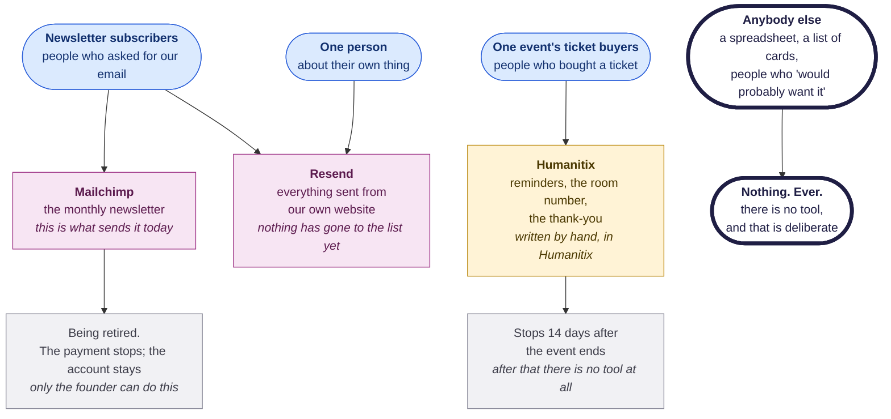

# The email playbook

Who She Sharp is allowed to email, which system sends it, and what has to happen
before anything goes out. On one page, for the people who do it.

**How to use this.** This is not a how-to for any one email. It is the set of
rules the tools already enforce, written down so you know them before you hit a
refusal rather than after. Read the section that matches the thing you are about
to do.

Three teams share this page — newsletter, marketing and events — because email
is the one thing all three do, and the rules are the same for all three.

**Nothing here is a rule anyone invented for the fun of it.** Every one of them
exists because getting it wrong costs the organisation something specific, and
each section says what.

---

## The whole thing, once



| Colour | What it is |
|---|---|
| Blue | The people. **Which group somebody is in decides everything else** |
| Pink | A system She Sharp controls. The mail leaves `shesharp.org.nz` |
| Gold | Humanitix. Their tool, their address, their time limit |
| Grey | A limit nobody in this organisation can change |
| Outlined | The answer is no, and there is nothing to look for |

---

## 1. Who we are allowed to email

There are four groups of people, and **which group someone is in is a fact about
one permission, not about the person**. The same person can be in two groups at
once.

| Group | Who | What may be sent to them |
|---|---|---|
| **Subscribers** | People who asked for our email and are on the mailing list | Anything: the newsletter, an announcement, an event we want them to come to |
| **People who wrote to us** | Somebody who used the contact form | A reply about the thing they asked. Nothing else, ever |
| **People doing their own thing** | Ticket buyers, donors, mentors and mentees, volunteers, account holders | Only the mail that finishes what they started: the room number for the event they booked, a receipt for their own donation, an update on their own application |
| **Everybody else** | An inherited spreadsheet, a stack of business cards, a list somebody exported from somewhere | **Nothing. Ever** |

### The rule all four exist to enforce

**Consent does not transfer between lists.**

Somebody who registered for the July workshop agreed to hear about the July
workshop. They did not agree to the newsletter, to the next event, or to a
donation appeal.

None of these is subscribing:

- registering for an event
- making a donation
- applying to mentor, to be mentored, or to volunteer
- filling in the contact form
- creating an account on the website
- emailing us directly
- signing a paper sheet at the door that did not ask

That list is not a technicality. It is the whole rule, written out so nobody has
to guess at the edges.

### Why it is worth the inconvenience

Write it down the way you would have to say it out loud. If somebody replies
*"where did you get my address?"*, the answer has to be a fact — where they
agreed, and when — not an argument about why they would probably be pleased.
The moment you find yourself building that argument, you have already left the
rules.

> **The authority is not this page.** The complete rule, with the four ways
> somebody can legitimately end up on the list and what evidence each one needs,
> is `.claude/skills/update-mailing-list/references/consent-rules.md`. This
> section is a summary of it on purpose. **Two copies of a rule is how one of
> them goes stale** — if this page and that file ever disagree, that file wins.
> Enforced in code by `assertSendAllowed()` in `lib/email/audience.ts`.

---

## 2. Which system sends what

Three platforms send email on She Sharp's behalf. Two of them survive the move
we are in the middle of.

| The people | Where it is written | What sends it | The address it comes from |
|---|---|---|---|
| Newsletter subscribers | our own project | **Resend** | `newsletter@shesharp.org.nz` |
| Newsletter subscribers, **today** | Mailchimp | **Mailchimp** | the Mailchimp account's address |
| One event's ticket buyers | the Humanitix console, by hand | **Humanitix** | a Humanitix address |
| One person, about their own thing | our own project | **Resend** | `noreply@` or `info@shesharp.org.nz` |

### Mailchimp — still the one that sends the newsletter

**Every newsletter that has actually reached anybody was sent from Mailchimp,
including the next one unless you are told otherwise.** It is being retired, but
retired is not the same as gone.

Two things staff should know about the retirement:

- **The payment is being stopped. The account is not being closed.** Those are
  two different buttons on two different screens in Mailchimp, and only one of
  them is happening. The account, the audience and seven years of campaign
  history stay.
- **The last Mailchimp newsletter has to go out before the payment stops**, not
  after. Once the account drops to the free plan it cannot send to a list this
  size at all.

Only the founder can do any of it — it needs the Mailchimp login, and nobody
working on the website has that.

> Where this is written down: `docs/deployment/MAILCHIMP_CANCELLATION.md`. It is
> a checklist for the founder, in English and Chinese, and it is the only place
> the steps are recorded.

### Resend — everything that leaves our own website

Password resets, verification links, donation receipts, mentorship application
updates, replies to the contact form, and — when the move finishes — the
newsletter. All of it from `shesharp.org.nz`.

### Humanitix — mail to one event's ticket buyers

This one is not written in the project at all. The events team opens the event
in Humanitix, goes to **Email campaigns**, and writes it there. Humanitix
already knows who bought a ticket, so there is nothing to export and nothing to
upload.

Three limits, none of which anyone here can change:

- **It leaves a Humanitix address, not ours.** You can change the *name* it
  appears to come from. You cannot change the address.
- **You cannot choose who is on the list.** It is that event's registrants, and
  that is the point of the tool.
- **It stops 14 days after the event ends.** Humanitix will not send for an
  event that finished more than a fortnight ago.

**That last one matters more than it looks.** A gallery link or a write-up that
is ready three weeks later has nowhere to go — not Humanitix, because the window
has shut, and not from us, because those people are ticket buyers and a gallery
mail from us would be using a list we hold for a different reason.
**A late follow-up has no tool at all.** So send the thank-you the day after the
event, not when the photographs are ready.

> Where this is written down: `docs/development/EMAIL_RESPONSIBILITY_BOUNDARIES.md`
> — which system sends to whom, why registrant mail is not in this project, and
> what that knowingly gives up.

---

## 3. Before the monthly newsletter goes out

> **Not in place yet.** The steps below are agreed and built, but the change that
> enforces them has not been merged. Until it is, the ordering is a habit rather
> than a gate. Ask in `#website-team` before running a newsletter send.

Three stages, in this order. Each one has to be on the record before the next
can happen.

1. **A test to your own mailbox.** One address — yours. This is where you find
   out whether the issue actually renders.
2. **A review round.** One email each to the founder and to the named internal
   reviewers. Everybody gets their own copy, so nobody sees anybody else's
   address. This is *how the founder sees the issue*, and it comes before her
   approval rather than after it.
3. **The founder's approval.** Recorded with the evidence — where she said yes.
   **Only this stage unlocks the real send.**

**This is enforced by a check that refuses, not by everybody remembering.** The
check that runs immediately before a send exits with an error if stage 2 is
missing, if the approval was recorded before the review round it is supposed to
follow, or if there is no approval at all. It is designed so the send cannot be
half-run.

**One thing is waiting on a person, not on code.** The list of internal
reviewers currently names only the founder, and the review round **refuses to
run** with a round of one. Somebody has to supply the names and addresses of the
newsletter, marketing and events people who should see an issue before it goes
out. Until they are supplied, stage 2 cannot happen and therefore nor can a
send.

A useful thing to ask, once this is live:

```
Has the NEWSLETTER MONTH issue cleared all three approval stages? Show me what
is on the record for each one, and do not send anything.
```

---

## 4. How often we may email the list

**At most three marketing emails to the subscriber list in any calendar month,
counted across every tool.** The monthly newsletter is one of them. An
announcement to the whole list is one of them. Promoting an event is one of
them. Sending a big list in several batches over a few days is still **one**,
not one per batch.

> **Not in place yet** as an automatic check — same change as the section above.
> The number is the agreed rule either way.

### The reason, in the terms that matter

Too many emails produce spam complaints. Spam complaints are counted against the
**whole account**, and the threshold is far smaller than people expect: about
**0.08%** — roughly **one and a quarter complaints** on a send to the full list.

Cross it and the account is throttled. That does not just stop the newsletter.
**It stops password resets, verification emails and donation receipts**, because
they go out through the same account. One over-eager campaign can take down the
part of the website that has nothing to do with campaigns.

There is a way to send more than three in a month, and it is deliberately not
convenient: somebody has to override the cap and write down the reason, which is
then on the record.

A useful thing to ask before you plan a send:

```
How many marketing emails have already gone to the subscriber list this month,
and what were they? Do not send anything.
```

---

## 5. How somebody gets on the list, and how they get off

### On — two ways, and there is no third

1. **They subscribe themselves.** They fill in the form on the website, then
   press a button in the email we send them to confirm it. Both halves are
   required: the form alone is not a subscription until the button is pressed.
2. **They tick an opt-in box on a form they were filling in anyway** — the
   Humanitix checkout box is the one we actually use — and that tick is recorded
   along with the exact question they were asked and the date they were asked
   it.

That is the complete list. There is no "they'd probably want it" route, and
there is no route that starts with somebody's spreadsheet.

If you cannot say which of the two applies to a group of people, the honest
answer is to send them the subscribe link inside an email they were already
expecting, and let the ones who want it put themselves on:

> https://www.shesharp.org.nz/newsletter/subscribe

**This is not a lesser outcome.** Forty people who chose to be there outperform
four hundred who did not, and it is the only version that survives a complaint.

### Off — one click, and it is permanent

Every marketing email carries a one-click unsubscribe. Somebody who uses it,
whose address bounces, or who marks a send as spam, is out.

**Leaving is permanent.** Nobody is put back:

- not by an import
- not by hand
- not because their address turns up in a newer file

The trap is mechanical and easy to fall into without noticing. Somebody
unsubscribes in March. In July they buy a ticket, so their address is in July's
attendee export — which has no idea they ever unsubscribed. Import that
carelessly and their opt-out is silently undone. They receive the next
newsletter, and the only thing they learn about She Sharp is that unsubscribing
does not work here.

**The one way back is the person themselves, through the website form.** If
somebody tells you *"actually she does want it again"*, the answer is to send
her the link — not to change anything.

One exception with no way back at all: somebody who marked a send as spam is
never re-added, whatever they later say and whatever the dates are.

---

## 6. Six things never to do

1. **Never paste a list of addresses into a spreadsheet and ask for it to be
   mailed.** Where the addresses came from is the only question that matters,
   and a spreadsheet cannot answer it.
2. **Never re-use an event's registrant list as a mailing list.** Buying a ticket
   is not subscribing. If you try, it will refuse — and that refusal is correct.
3. **Never email people because they would probably want it.** That sentence is
   the warning sign, not the justification.
4. **Never put a code in an email** — registration codes, discount codes, door
   codes, meeting passwords. Link to the public page instead. This has gone
   wrong before and it was expensive to undo.
5. **Never paste real addresses into Slack, a message, or a document.** Every
   tool here hides them (`j****@gmail.com`) on purpose; keep it that way.
6. **Never put somebody back on the list who left.** See the section above. There
   is one way back and it is not us.

---

## 7. Where the list came from, and what we can prove

This section exists because staff should not learn this from somebody outside
the organisation.

**The mailing list held 1,549 people on 30 August 2026.** It moves, so treat
that as a reading rather than a fact about today. To re-take it:

```
Print the current number of mailable newsletter subscribers, and do not send
anything or change anything.
```

The command it runs is `npx tsx scripts/email/suppression.ts reconcile`.

### What we know about why each of them is on it

Also measured on **30 August 2026**, counting each person once, in the strongest
category they qualify for:

| How we know they wanted it | People |
|---|---|
| They filled in a sign-up form themselves | 198 |
| They confirmed separately after opting in | 128 |
| They ticked the box when buying a ticket | 55 |
| **They bought a ticket and never ticked anything** | **752** |
| **We cannot tell** | **416** |
| | **1,549** |

### Why, and it is nobody's carelessness

Humanitix has been connected to Mailchimp for about six years. Every ticket
purchase passed the buyer's name and address to Mailchimp automatically.

That connection had a second setting — **"sync contacts who haven't opted-in"** —
and it was **switched on** until **27 August 2026**. With it on, every buyer went
onto the mailing list whether they had agreed to anything or not. Meanwhile the
opt-in tick-box at checkout had been **switched off since May 2022**, so for four
years nobody was even asked.

Nobody set that up recently and nobody was watching it. It ran on its own. The
setting responsible is now off; retiring the connection altogether is a separate
job inside the Humanitix account, and only the founder can do it.

### What this does and does not mean

**Read this part carefully, because it is easy to over-read in both
directions.**

- **These people are validly on the list.** The organisation's own rule defines
  the mailing list as that table, and they are in it. Nothing here says anybody
  should be removed.
- **They have been receiving the newsletter for years, and it has been fine.**
  Across 180 campaigns and 188,796 emails sent between July 2019 and August 2026,
  there have been **four** spam complaints in total.
- **So this is not an emergency, and nobody should be alarmed.**
- **What it does mean is narrower, and worth saying exactly.** If somebody asks
  *"why am I on your list?"*, then for roughly **three-quarters** of the list we
  could not give them a good answer. That is the thing being fixed — going
  forward, not retrospectively.

One more limit on those numbers, so nobody quotes them as more than they are:
they show what we can *prove*, not what people actually wanted. Somebody who
bought a ticket in 2021 and separately signed up on the website afterwards still
counts in the ticket-buyer row, because the record keeps the first thing that
happened and never updates it.

> Where the full measurement lives, with its method and its three limits:
> `docs/development/EMAIL_PLATFORM_STATE.md`. Every figure on this page carries
> the date it was taken because **all of them move**.

---

## 8. What is not switched over yet

Say this plainly whenever it comes up, because a list that exists invites the
assumption that it is in use.

- **Nothing has ever been sent from She Sharp's own subscriber list.** Not one
  email. The pipeline has been tested to the maintainer's own address and
  nowhere else.
- **The live newsletter still goes out from Mailchimp.** A populated list is not
  a cutover.
- The subscribe form, the confirmation step and the one-click unsubscribe **are**
  live on the website today.
- The approval chain and the frequency cap in sections 3 and 4 are **built but
  not merged**, and the reviewer names have not been supplied.

If somebody describes the move off Mailchimp as done, it is not.

---

## If you want the detail

None of the following is required to do the job. Each is the authority on its
own subject, and each is the only place its subject is written down.

- `.claude/skills/update-mailing-list/references/consent-rules.md` — **who may be
  emailed**, the four groups, the four ways onto the list, and what evidence each
  needs
- `docs/development/EMAIL_RESPONSIBILITY_BOUNDARIES.md` — **which system sends
  what**, and why registrant mail is not in this project
- `docs/deployment/MAILCHIMP_CANCELLATION.md` — **stopping the Mailchimp
  payment**, for the founder
- `docs/development/EMAIL_PLATFORM_STATE.md` — where all three platforms actually
  stand, with every measurement dated
- `docs/development/EVENT_PLAYBOOK.md` — the same treatment for running one event
- **`#website-team`** — the answer to anything not covered here. Ask there rather
  than working it out alone; that is what it is for.
